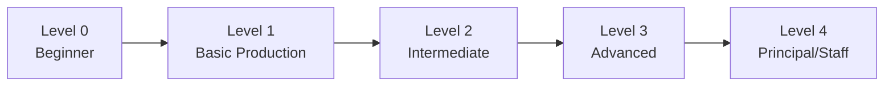

# 03 — Design Levels

> Every system design supports 5 complexity levels. A beginner and a staff engineer see the same system at different depths.

---

## Level Overview



---

## Level 0 — Beginner

**Target**: Complete beginners, CS students

**Architecture**:

```
User
 ↓
Backend (single server)
 ↓
Database
```

**Components Visible**: 3

| Component | Technology |
|---|---|
| Client | Web Browser |
| Backend | Single Application Server |
| Database | PostgreSQL (single instance) |

**Schema Sections Visible**: 4

- Problem Definition
- Functional Requirements
- High-Level Architecture (simplified)
- Data Model (simplified)

**Language**: Simple, no jargon. Explain everything.

**Example Explanation**:
> "The user sends a request to our server. The server processes it and stores data in the database. The database is where all information lives permanently."

---

## Level 1 — Basic Production

**Target**: Junior engineers, bootcamp grads

**Architecture**:

```
Users
 ↓
DNS
 ↓
Load Balancer
 ↓
API Servers (×2)
 ↓
Database (primary + replica)
 ↓
Cache (Redis)
```

**Components Visible**: 6

| Component | Technology | Why Introduced |
|---|---|---|
| DNS | Route 53 | Domain resolution |
| Load Balancer | Nginx / ALB | Distribute traffic, eliminate single server |
| API Servers | FastAPI (×2) | Horizontal scaling |
| Database Primary | PostgreSQL | Write operations |
| Database Replica | PostgreSQL | Read operations |
| Cache | Redis | Reduce database load |

**Schema Sections Visible**: 8

- Problem Definition
- Functional Requirements
- Non-Functional Requirements
- Assumptions
- API Design (basic)
- Data Model
- High-Level Architecture
- Database (basic)

**Language**: Introduce basic infrastructure concepts. Explain why each component exists.

---

## Level 2 — Intermediate

**Target**: Mid-level engineers (2-5 years), interview prep

**Architecture**:

```
Users
 ↓
CDN ──── Static Assets / Media
 ↓
Load Balancer
 ↓
API Gateway
 ├── Service A
 ├── Service B
 └── Service C
      ├── PostgreSQL (primary + replicas)
      ├── Redis Cluster
      ├── Object Storage (S3)
      ├── Message Queue (RabbitMQ/Kafka)
      └── Elasticsearch
 ↓
Monitoring (Prometheus + Grafana)
```

**Components Visible**: 12-15

| Added Component | Why Introduced |
|---|---|
| CDN | Serve static content globally, reduce latency |
| API Gateway | Routing, rate limiting, authentication |
| Multiple Services | Separation of concerns |
| Object Storage | Binary data (images, videos, files) |
| Message Queue | Async processing, decoupling |
| Search Engine | Full-text search |
| Monitoring | System observability |

**Schema Sections Visible**: 18

All sections from Level 1, plus:
- Capacity Estimation
- Component Architecture
- Data Flow
- Scaling Strategy
- Caching
- Messaging
- Security (basic)
- Trade-offs
- Alternatives

**Language**: Technical, assumes familiarity with distributed systems basics.

---

## Level 3 — Advanced

**Target**: Senior engineers (5-10 years), senior interview prep

**Architecture**:

```
Users
 ↓
Global DNS (GeoDNS)
 ↓
CDN (Multi-region)
 ↓
WAF
 ↓
Load Balancer (Layer 7)
 ↓
API Gateway (Rate Limiting, Auth, Throttling)
 │
 ├── Service A (Cluster, Auto-scaled)
 │    ├── Redis Cluster (Distributed Cache)
 │    └── PostgreSQL (Sharded, Multi-AZ)
 │
 ├── Service B (Cluster, Auto-scaled)
 │    ├── Elasticsearch Cluster
 │    └── S3 (Cross-region replicated)
 │
 └── Event Bus (Kafka Cluster)
      ├── Consumer Group: Processing
      ├── Consumer Group: Analytics
      └── Consumer Group: Notifications
 
 ↓
Observability Stack
 ├── Metrics (Prometheus)
 ├── Logging (ELK)
 ├── Tracing (Jaeger)
 └── Alerting (PagerDuty)
```

**Components Visible**: 20-30

| Added Component | Why Introduced |
|---|---|
| GeoDNS | Route users to nearest region |
| WAF | DDoS protection, security |
| Kafka Cluster | High-throughput event streaming |
| Database Sharding | Scale beyond single-instance limits |
| Distributed Cache | Redis cluster across nodes |
| Cross-region Replication | Data durability and locality |
| Circuit Breakers | Fault isolation between services |
| Service Mesh | Service-to-service communication |
| OpenTelemetry | Distributed tracing |
| Rate Limiter | Protect services from overload |

**Schema Sections Visible**: 24

All sections from Level 2, plus:
- Consistency
- Availability
- Fault Tolerance
- Observability
- Disaster Recovery
- Cost Estimation
- Bottlenecks

**Language**: Deep technical, discusses CAP theorem, consistency models, partition strategies.

---

## Level 4 — Principal / Staff Engineer

**Target**: Staff+ engineers, system architects, senior+ interview prep

**Architecture**: Everything from Level 3, plus the platform now actively **challenges** the user.

**Challenge Questions Generated**:

| Category | Example Question |
|---|---|
| Failure | "What happens if the primary database fails during a transaction?" |
| Scale | "What happens during a 20× traffic spike on Black Friday?" |
| Consistency | "How do you maintain consistency across shards?" |
| Recovery | "What is your RPO/RTO? How do you achieve it?" |
| Migration | "How do you perform zero-downtime database migrations?" |
| Regional | "What happens if us-east-1 goes completely offline?" |
| Cost | "Your estimated monthly cost is $46K. Can you reduce it by 40%?" |
| Operations | "How does your on-call team respond to a Kafka consumer lag of 10M?" |

**Schema Sections Visible**: 26 (all)

All sections from Level 3, plus:
- Production Considerations
- Interview Discussion

**Language**: Principal-level, discusses organizational trade-offs, cost-benefit analysis, multi-year planning.

---

## Level Transition Rules

### What Changes When Switching Levels

| Aspect | How It Changes |
|---|---|
| **Nodes** | Components appear/disappear on the canvas |
| **Connections** | Edges simplify or expand |
| **Schema Sections** | Panels show/hide based on level visibility |
| **Explanations** | Language complexity adjusts |
| **Component Details** | Depth of detail in explorer panel increases |
| **Challenge Questions** | Only appear at Level 4 |

### Progressive Enhancement (Not Replacement)

Level N always **includes** everything from Level N-1. Higher levels add complexity, they never remove foundational elements.

```
Level 0: { Backend, Database }
Level 1: Level 0 + { LB, Replicas, Cache }
Level 2: Level 1 + { CDN, MQ, Services, Storage, Monitoring }
Level 3: Level 2 + { Sharding, Kafka, Multi-region, Observability }
Level 4: Level 3 + { Challenge Mode, Production, Interview }
```

### Level Metadata Per Node

Each node in the architecture graph carries a `min_level` property:

```json
{
  "id": "kafka",
  "type": "message_queue",
  "technology": "Kafka",
  "min_level": 3,
  "label": "Event Bus"
}
```

The canvas only renders nodes where `min_level <= selected_level`.

---

## Level Selection UI

```
┌─────────────────────────────────────────┐
│ Design Level                            │
│                                         │
│  ○ Level 0 — Beginner                   │
│  ○ Level 1 — Basic Production           │
│  ● Level 2 — Intermediate               │
│  ○ Level 3 — Advanced                   │
│  ○ Level 4 — Principal/Staff            │
│                                         │
│  ─────────────●───────────────          │
│  0    1    2    3    4                   │
│                                         │
│  Components visible: 14/28              │
│  Schema sections: 18/26                 │
└─────────────────────────────────────────┘
```

Users should be able to switch levels at any time with a slider or radio buttons. The canvas animates the transition (nodes fade in/out).

---

## Related Documents

- [02-system-design-schema.md](./02-system-design-schema.md) — Schema sections and level visibility
- [13-canvas-architecture.md](./13-canvas-architecture.md) — How the canvas renders levels
- [07-ai-engine.md](./07-ai-engine.md) — How AI adjusts language per level
