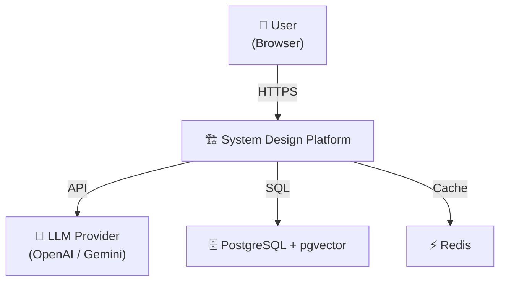
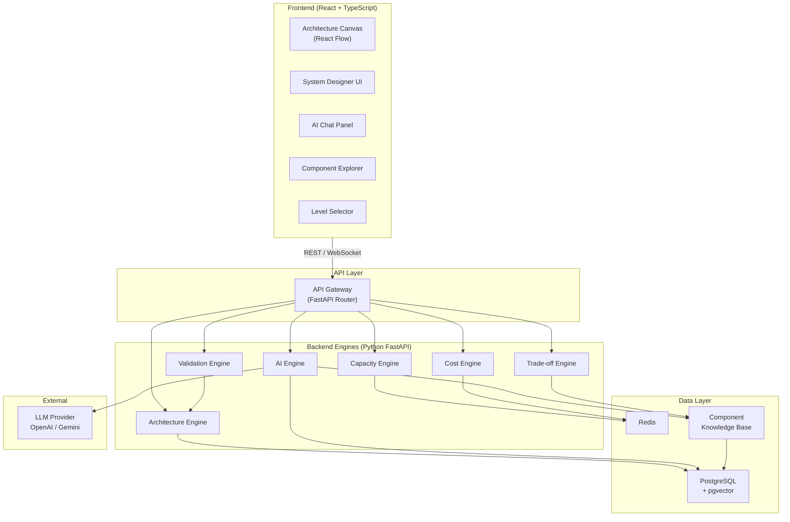
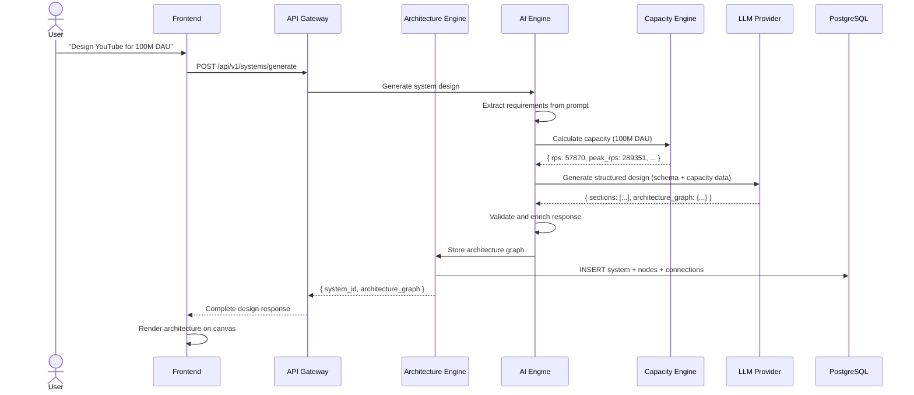
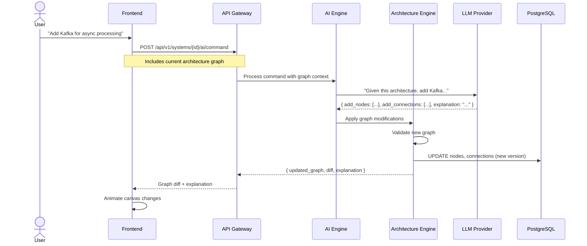

# 04 — Architecture Overview

> The platform's own technical architecture — how all the pieces fit together.

---

## System Context



---

## High-Level Architecture



---

## Layer Breakdown

### Layer 1: Frontend

| Component | Technology | Responsibility |
|---|---|---|
| Architecture Canvas | React Flow | Visual node/edge graph, drag-and-drop, zoom/pan |
| System Designer | React + TypeScript | Input form for new designs, parameter selection |
| AI Chat Panel | React | Chat interface for AI assistant |
| Component Explorer | React | Side panel with deep-dive component info |
| Level Selector | React | Slider/radio for Level 0–4 switching |
| State Management | Zustand | Global state: architecture graph, UI state, chat |
| API Client | Axios / fetch | REST communication with backend |
| WebSocket Client | Native WebSocket | Real-time AI streaming responses |

### Layer 2: API Gateway

| Component | Technology | Responsibility |
|---|---|---|
| API Router | FastAPI | Route requests to appropriate engine |
| Auth Middleware | FastAPI Depends | JWT validation, rate limiting |
| WebSocket Handler | FastAPI WebSocket | Stream AI responses |
| Request Validation | Pydantic | Validate all incoming requests |
| CORS | FastAPI CORS | Cross-origin resource sharing |

### Layer 3: Backend Engines

| Engine | Responsibility | Dependencies |
|---|---|---|
| **Architecture Engine** | Create, modify, validate architecture graphs | PostgreSQL, Validation Engine |
| **AI Engine** | Orchestrate LLM calls, structured output, RAG | LLM Provider, Knowledge Base, pgvector |
| **Capacity Engine** | Deterministic capacity calculations | None (pure computation) |
| **Cost Engine** | Infrastructure cost estimation | Cost data (static/Redis) |
| **Trade-off Engine** | Technology comparison and recommendation | Knowledge Base |
| **Validation Engine** | Validate architecture graph integrity | Architecture Engine |

### Layer 4: Data Layer

| Component | Technology | Stores |
|---|---|---|
| PostgreSQL | PostgreSQL 16+ | Systems, versions, nodes, connections, requirements, decisions |
| pgvector | pgvector extension | Embeddings for RAG (component knowledge, design patterns) |
| Redis | Redis 7+ | Session cache, rate limiting, capacity calc cache |
| Knowledge Base | PostgreSQL + JSON | Component metadata, comparison data, best practices |

---

## Data Flow: Generate a System Design



---

## Data Flow: AI Modifies Canvas



---

## Communication Patterns

| Pattern | Used For | Protocol |
|---|---|---|
| REST | CRUD operations, design generation | HTTP/JSON |
| WebSocket | AI streaming responses, real-time collaboration | WS |
| Server-Sent Events | Long-running generation progress | SSE (alternative to WS) |

---

## Error Handling Strategy

```
Frontend
  → Retry with exponential backoff for transient errors
  → Show user-friendly error messages
  → Maintain canvas state even on API failure

API Gateway
  → Return structured error responses { error, code, message, details }
  → Rate limit per-user and per-endpoint
  → Circuit breaker for LLM provider

Backend Engines
  → Each engine handles its own errors
  → Fallback: if LLM fails, show cached/partial results
  → Validation engine catches invalid graph mutations

Data Layer
  → PostgreSQL transactions for graph mutations (all-or-nothing)
  → Redis fallback to PostgreSQL if cache is down
```

---

## Scalability Path

### MVP (Phase 1)
- Single FastAPI instance
- Single PostgreSQL instance
- Single Redis instance
- Direct LLM API calls

### Scale (Phase 2+)
- Multiple FastAPI workers behind load balancer
- PostgreSQL read replicas
- Redis cluster
- Background task queue (Celery/ARQ) for long-running generations
- LLM response caching

---

## Related Documents

- [05-frontend-architecture.md](./05-frontend-architecture.md) — Frontend deep dive
- [06-backend-architecture.md](./06-backend-architecture.md) — Backend engine details
- [07-ai-engine.md](./07-ai-engine.md) — AI pipeline
- [08-data-model.md](./08-data-model.md) — Database schema
