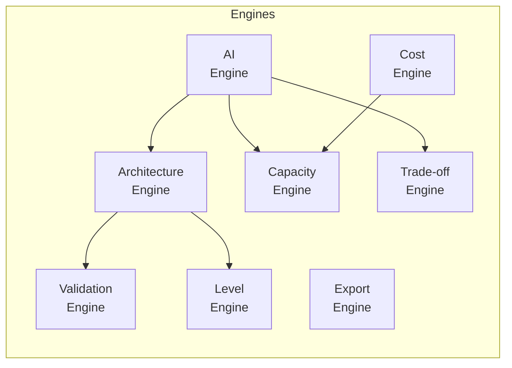

# 06 — Backend Architecture

> Python FastAPI — engines, services, and API design

---

## Tech Stack

| Layer | Technology |
|---|---|
| Framework | FastAPI |
| Language | Python 3.12+ |
| ORM | SQLAlchemy 2.0 (async) |
| Migrations | Alembic |
| Validation | Pydantic v2 |
| Task Queue | ARQ (async Redis queue) |
| Testing | pytest + httpx |
| Linting | Ruff |
| Type Checking | mypy |

---

## Project Structure

```
backend/
├── app/
│   ├── __init__.py
│   ├── main.py                      # FastAPI app factory
│   ├── config.py                    # Settings (env vars, secrets)
│   ├── dependencies.py              # Dependency injection
│   │
│   ├── api/                         # API route handlers
│   │   ├── __init__.py
│   │   ├── router.py                # Main router aggregation
│   │   ├── v1/
│   │   │   ├── __init__.py
│   │   │   ├── systems.py           # /systems endpoints
│   │   │   ├── nodes.py             # /systems/{id}/nodes endpoints
│   │   │   ├── connections.py       # /systems/{id}/connections endpoints
│   │   │   ├── ai.py                # /systems/{id}/ai endpoints
│   │   │   ├── components.py        # /components knowledge base
│   │   │   ├── capacity.py          # /capacity estimation
│   │   │   ├── cost.py              # /cost estimation
│   │   │   ├── tradeoffs.py         # /tradeoffs comparisons
│   │   │   ├── export.py            # /systems/{id}/export
│   │   │   └── library.py           # /library pre-built designs
│   │   └── websocket.py             # WebSocket handlers
│   │
│   ├── engines/                     # Core business logic engines
│   │   ├── __init__.py
│   │   ├── architecture.py          # Architecture graph engine
│   │   ├── ai_engine.py             # AI orchestration engine
│   │   ├── capacity.py              # Capacity calculation engine
│   │   ├── cost.py                  # Cost estimation engine
│   │   ├── tradeoff.py              # Technology comparison engine
│   │   ├── validation.py            # Architecture validation engine
│   │   ├── level.py                 # Level filtering engine
│   │   └── export.py                # Export engine (PNG, SVG, JSON, etc.)
│   │
│   ├── ai/                          # AI-specific modules
│   │   ├── __init__.py
│   │   ├── provider.py              # LLM provider abstraction
│   │   ├── prompts/                 # System prompts and templates
│   │   │   ├── __init__.py
│   │   │   ├── system_prompt.py     # Base system prompt
│   │   │   ├── generate.py          # Design generation prompts
│   │   │   ├── modify.py            # Architecture modification prompts
│   │   │   ├── explain.py           # Component explanation prompts
│   │   │   ├── interview.py         # Interview mode prompts
│   │   │   └── schemas.py           # Structured output schemas
│   │   ├── rag.py                   # RAG pipeline (pgvector)
│   │   └── structured_output.py     # JSON schema enforcement
│   │
│   ├── models/                      # SQLAlchemy models
│   │   ├── __init__.py
│   │   ├── system.py                # System design model
│   │   ├── node.py                  # Architecture node model
│   │   ├── connection.py            # Architecture connection model
│   │   ├── version.py               # System version model
│   │   ├── component.py             # Component knowledge model
│   │   ├── decision.py              # Architecture decision model
│   │   └── base.py                  # Base model with common fields
│   │
│   ├── schemas/                     # Pydantic request/response schemas
│   │   ├── __init__.py
│   │   ├── system.py                # System CRUD schemas
│   │   ├── graph.py                 # Architecture graph schemas
│   │   ├── ai.py                    # AI request/response schemas
│   │   ├── capacity.py              # Capacity schemas
│   │   ├── cost.py                  # Cost schemas
│   │   ├── tradeoff.py              # Trade-off schemas
│   │   ├── component.py             # Component knowledge schemas
│   │   └── export.py                # Export schemas
│   │
│   ├── services/                    # Data access layer
│   │   ├── __init__.py
│   │   ├── system_service.py        # System CRUD
│   │   ├── graph_service.py         # Graph node/connection CRUD
│   │   ├── component_service.py     # Component knowledge CRUD
│   │   ├── version_service.py       # Version management
│   │   └── cache_service.py         # Redis cache operations
│   │
│   ├── knowledge/                   # Component knowledge base data
│   │   ├── __init__.py
│   │   ├── loader.py                # Load knowledge from JSON/YAML
│   │   ├── components/              # Component definitions
│   │   │   ├── databases.yaml
│   │   │   ├── caches.yaml
│   │   │   ├── queues.yaml
│   │   │   ├── compute.yaml
│   │   │   ├── storage.yaml
│   │   │   ├── networking.yaml
│   │   │   └── observability.yaml
│   │   └── patterns/                # Architecture patterns
│   │       ├── cqrs.yaml
│   │       ├── event_sourcing.yaml
│   │       ├── saga.yaml
│   │       └── circuit_breaker.yaml
│   │
│   └── db/                          # Database utilities
│       ├── __init__.py
│       ├── session.py               # Async session factory
│       └── migrations/              # Alembic migrations
│           ├── env.py
│           └── versions/
│
├── tests/
│   ├── conftest.py
│   ├── test_engines/
│   │   ├── test_capacity.py
│   │   ├── test_cost.py
│   │   ├── test_architecture.py
│   │   └── test_validation.py
│   ├── test_api/
│   │   ├── test_systems.py
│   │   ├── test_ai.py
│   │   └── test_export.py
│   └── test_ai/
│       ├── test_prompts.py
│       └── test_structured_output.py
│
├── pyproject.toml
├── alembic.ini
├── Dockerfile
└── .env.example
```

---

## Engine Architecture

Each engine is a stateless class with pure business logic:



### Architecture Engine

```python
class ArchitectureEngine:
    """Manages the architecture graph — the source of truth."""
    
    async def create_system(self, prompt: str, params: SystemParams) -> SystemDesign:
        """Create a new system design from a prompt."""
    
    async def add_node(self, system_id: UUID, node: ArchNode) -> ArchNode:
        """Add a node to the architecture graph."""
    
    async def remove_node(self, system_id: UUID, node_id: str) -> GraphDiff:
        """Remove a node and its connections."""
    
    async def add_connection(self, system_id: UUID, conn: ArchConnection) -> ArchConnection:
        """Connect two nodes."""
    
    async def apply_diff(self, system_id: UUID, diff: GraphDiff) -> SystemDesign:
        """Apply a set of graph changes atomically (used by AI engine)."""
    
    async def get_graph(self, system_id: UUID, level: int = 4) -> ArchitectureGraph:
        """Get the architecture graph filtered by level."""
    
    async def create_version(self, system_id: UUID) -> SystemVersion:
        """Snapshot the current graph as a new version."""
```

### AI Engine

```python
class AIEngine:
    """Orchestrates LLM calls with structured output."""
    
    async def generate_design(self, prompt: str, params: SystemParams) -> SystemDesign:
        """Generate a complete system design.
        
        Pipeline:
        1. Extract requirements from prompt
        2. Call Capacity Engine for real numbers
        3. Query RAG for relevant patterns
        4. Call LLM with schema + capacity + patterns
        5. Validate structured output
        6. Return SystemDesign
        """
    
    async def process_command(self, system_id: UUID, command: str, graph: ArchitectureGraph) -> AIResponse:
        """Process a user command against the current architecture.
        
        Examples:
        - "Add Kafka between API and Database"
        - "Make this multi-region"
        - "Why Redis?"
        """
    
    async def explain_component(self, component_id: str, context: ArchitectureGraph) -> ComponentExplanation:
        """Explain why a component exists in this architecture."""
    
    async def analyze_bottlenecks(self, graph: ArchitectureGraph, capacity: CapacityEstimate) -> list[Bottleneck]:
        """Analyze architecture for bottlenecks given capacity requirements."""
```

### Capacity Engine

```python
class CapacityEngine:
    """Deterministic capacity calculations — NO LLM involved."""
    
    def calculate(self, params: CapacityParams) -> CapacityEstimate:
        """Calculate capacity metrics from user parameters.
        
        Inputs:
        - total_users, dau, requests_per_user_per_day
        - avg_payload_size_kb
        - read_write_ratio
        - peak_multiplier (default: 5)
        - growth_rate_monthly (default: 0.05)
        
        Outputs:
        - total_requests_per_day
        - average_rps
        - peak_rps
        - daily_storage_gb
        - monthly_storage_tb
        - yearly_storage_pb
        - bandwidth_gbps
        - peak_bandwidth_gbps
        """
    
    def recommend_infrastructure(self, estimate: CapacityEstimate) -> InfraRecommendation:
        """Recommend infrastructure sizing based on capacity.
        
        Returns:
        - api_instances (min, max)
        - database_type (single, replicated, sharded)
        - cache_needed (bool)
        - queue_needed (bool)
        - cdn_needed (bool)
        """
```

### Cost Engine

```python
class CostEngine:
    """Infrastructure cost estimation based on component configuration."""
    
    def estimate(self, graph: ArchitectureGraph, capacity: CapacityEstimate) -> CostEstimate:
        """Estimate monthly infrastructure cost.
        
        Uses pricing data for common cloud providers (AWS/GCP/Azure).
        Calculates per-component costs based on:
        - Instance types and counts
        - Storage volume
        - Network transfer
        - Managed service pricing
        """
    
    def optimize(self, estimate: CostEstimate, target_budget: float | None = None) -> CostOptimization:
        """Suggest cost optimization strategies.
        
        Returns:
        - optimized_cost
        - savings_percentage
        - changes: list of recommended changes
        """
```

### Trade-off Engine

```python
class TradeoffEngine:
    """Technology comparison and recommendation."""
    
    def compare(self, tech_a: str, tech_b: str, requirements: list[str]) -> ComparisonMatrix:
        """Compare two technologies across requirements.
        
        Returns a matrix with star ratings (1-5) per requirement.
        """
    
    def recommend(self, category: str, requirements: SystemRequirements) -> Recommendation:
        """Recommend the best technology for a category given requirements.
        
        Categories: database, cache, queue, compute, storage, cdn
        """
    
    def challenge(self, technology: str, context: ArchitectureGraph) -> ChallengeResponse:
        """Argue against the current technology choice."""
```

### Validation Engine

```python
class ValidationEngine:
    """Validate architecture graph integrity and best practices."""
    
    def validate_graph(self, graph: ArchitectureGraph) -> ValidationResult:
        """Check graph validity.
        
        Checks:
        - No orphan nodes (disconnected from graph)
        - No circular dependencies (where inappropriate)
        - Database has at least one consumer
        - Services have at least one data store
        - Load balancer has multiple backends
        - Every public service behind API gateway
        """
    
    def validate_against_requirements(self, graph: ArchitectureGraph, requirements: SystemRequirements) -> list[Warning]:
        """Check if architecture meets stated requirements.
        
        Warnings:
        - "Single database cannot handle 86K peak RPS"
        - "No caching layer for read-heavy workload (100:1 ratio)"
        - "No CDN for global user base"
        """
```

---

## API Endpoints Summary

### Systems

| Method | Endpoint | Description |
|---|---|---|
| POST | `/api/v1/systems/generate` | Generate new system design |
| GET | `/api/v1/systems` | List all systems |
| GET | `/api/v1/systems/{id}` | Get system with graph |
| PUT | `/api/v1/systems/{id}` | Update system metadata |
| DELETE | `/api/v1/systems/{id}` | Delete system |

### Graph Manipulation

| Method | Endpoint | Description |
|---|---|---|
| GET | `/api/v1/systems/{id}/graph` | Get architecture graph (with level filter) |
| POST | `/api/v1/systems/{id}/nodes` | Add node |
| PUT | `/api/v1/systems/{id}/nodes/{nid}` | Update node |
| DELETE | `/api/v1/systems/{id}/nodes/{nid}` | Delete node |
| POST | `/api/v1/systems/{id}/connections` | Add connection |
| DELETE | `/api/v1/systems/{id}/connections/{cid}` | Delete connection |

### AI Assistant

| Method | Endpoint | Description |
|---|---|---|
| POST | `/api/v1/systems/{id}/ai/command` | AI modifies architecture |
| POST | `/api/v1/systems/{id}/ai/explain` | AI explains component/decision |
| POST | `/api/v1/systems/{id}/ai/analyze` | AI analyzes bottlenecks |
| WS | `/ws/systems/{id}/ai/chat` | Streaming AI chat |

### Engines

| Method | Endpoint | Description |
|---|---|---|
| POST | `/api/v1/capacity/calculate` | Calculate capacity |
| POST | `/api/v1/cost/estimate` | Estimate cost |
| POST | `/api/v1/tradeoffs/compare` | Compare technologies |
| POST | `/api/v1/tradeoffs/recommend` | Get recommendation |

### Knowledge Base

| Method | Endpoint | Description |
|---|---|---|
| GET | `/api/v1/components` | List all components |
| GET | `/api/v1/components/{slug}` | Get component details |
| GET | `/api/v1/components/categories` | List categories |

### Export

| Method | Endpoint | Description |
|---|---|---|
| POST | `/api/v1/systems/{id}/export` | Export (format: png, svg, json, md, mermaid) |

### Library

| Method | Endpoint | Description |
|---|---|---|
| GET | `/api/v1/library` | List pre-built designs |
| GET | `/api/v1/library/{slug}` | Get pre-built design |
| POST | `/api/v1/library/{slug}/fork` | Fork pre-built design into user's systems |

---

## Dependency Injection

```python
# dependencies.py

async def get_db() -> AsyncGenerator[AsyncSession, None]:
    async with async_session() as session:
        yield session

async def get_redis() -> Redis:
    return Redis.from_url(settings.REDIS_URL)

def get_architecture_engine(db: AsyncSession = Depends(get_db)) -> ArchitectureEngine:
    return ArchitectureEngine(db)

def get_ai_engine(
    arch: ArchitectureEngine = Depends(get_architecture_engine),
    capacity: CapacityEngine = Depends(get_capacity_engine),
) -> AIEngine:
    return AIEngine(arch_engine=arch, capacity_engine=capacity, llm=get_llm_provider())

def get_capacity_engine() -> CapacityEngine:
    return CapacityEngine()  # Pure computation, no dependencies

def get_cost_engine(
    capacity: CapacityEngine = Depends(get_capacity_engine),
) -> CostEngine:
    return CostEngine(capacity_engine=capacity)
```

---

## Error Handling

```python
# Standard error response format
class ErrorResponse(BaseModel):
    error: str          # Error type: "validation_error", "not_found", "ai_error"
    code: int           # HTTP status code
    message: str        # Human-readable message
    details: dict | None = None  # Additional context

# Example
{
    "error": "validation_error",
    "code": 400,
    "message": "Invalid architecture: node 'redis' has no connections",
    "details": {
        "node_id": "redis",
        "validation_rule": "no_orphan_nodes"
    }
}
```

---

## Related Documents

- [04-architecture-overview.md](./04-architecture-overview.md) — System context
- [07-ai-engine.md](./07-ai-engine.md) — AI pipeline details
- [08-data-model.md](./08-data-model.md) — Database models
- [18-api-specification.md](./18-api-specification.md) — Full API spec
