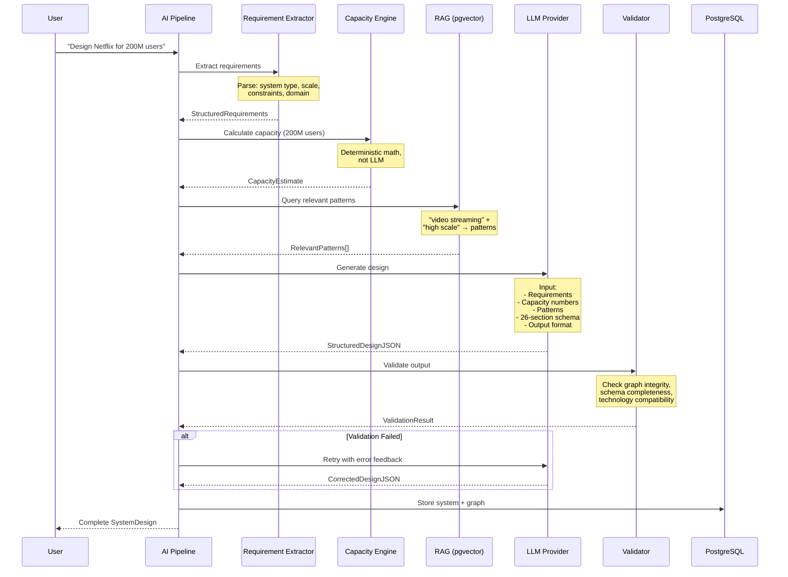
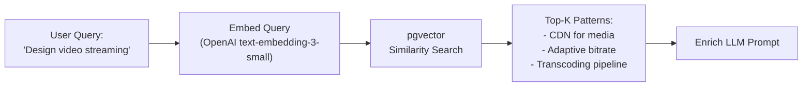
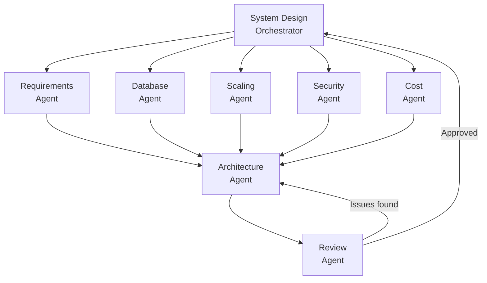

# 07 — AI Engine

> Multi-step AI pipeline with structured output, RAG, and tool calling.
> The LLM is NOT the source of truth — the architecture graph is.

---

## Design Philosophy

```
┌───────────────────────────────────────────────────┐
│                    WRONG                          │
│                                                   │
│  User: "Design Netflix"                           │
│           ↓                                       │
│  Send prompt directly to LLM                      │
│           ↓                                       │
│  Hope for good output                             │
└───────────────────────────────────────────────────┘

┌───────────────────────────────────────────────────┐
│                    RIGHT                          │
│                                                   │
│  User: "Design Netflix"                           │
│           ↓                                       │
│  Requirement Extraction                           │
│           ↓                                       │
│  Requirement Validation                           │
│           ↓                                       │
│  Capacity Calculator (deterministic)              │
│           ↓                                       │
│  RAG: Retrieve relevant patterns                  │
│           ↓                                       │
│  Architecture Planner (LLM + schema)              │
│           ↓                                       │
│  Technology Selector (Knowledge Base)             │
│           ↓                                       │
│  Structured JSON Output                           │
│           ↓                                       │
│  Validation Engine                                │
│           ↓                                       │
│  Architecture Graph (stored)                      │
│           ↓                                       │
│  Diagram Renderer (frontend)                      │
│           ↓                                       │
│  Explanation Generator                            │
└───────────────────────────────────────────────────┘
```

---

## Pipeline: Generate System Design



---

## LLM Provider Abstraction

```python
# ai/provider.py

from abc import ABC, abstractmethod

class LLMProvider(ABC):
    """Abstract LLM provider — supports multiple backends."""
    
    @abstractmethod
    async def generate(
        self,
        system_prompt: str,
        user_prompt: str,
        response_schema: dict | None = None,  # JSON Schema for structured output
        temperature: float = 0.7,
        max_tokens: int = 8000,
    ) -> LLMResponse:
        pass
    
    @abstractmethod
    async def generate_stream(
        self,
        system_prompt: str,
        user_prompt: str,
        **kwargs,
    ) -> AsyncGenerator[str, None]:
        pass


class OpenAIProvider(LLMProvider):
    """OpenAI GPT-4 provider with structured output support."""
    
    async def generate(self, system_prompt, user_prompt, response_schema=None, **kwargs):
        params = {
            "model": "gpt-4o",
            "messages": [
                {"role": "system", "content": system_prompt},
                {"role": "user", "content": user_prompt},
            ],
            "temperature": kwargs.get("temperature", 0.7),
        }
        if response_schema:
            params["response_format"] = {
                "type": "json_schema",
                "json_schema": response_schema,
            }
        # ... call OpenAI API


class GeminiProvider(LLMProvider):
    """Google Gemini provider."""
    
    async def generate(self, system_prompt, user_prompt, response_schema=None, **kwargs):
        # ... call Gemini API with structured output
        pass
```

---

## Structured Output Schema

The LLM is instructed to return JSON matching the 26-section schema:

```python
# ai/structured_output.py

DESIGN_RESPONSE_SCHEMA = {
    "type": "object",
    "properties": {
        "problem_definition": {
            "type": "object",
            "properties": {
                "title": {"type": "string"},
                "description": {"type": "string"},
                "domain": {"type": "string"},
                "similar_systems": {"type": "array", "items": {"type": "string"}},
            },
            "required": ["title", "description", "domain"],
        },
        "functional_requirements": {
            "type": "object",
            "properties": {
                "core": {"type": "array", "items": {"type": "string"}},
                "secondary": {"type": "array", "items": {"type": "string"}},
                "out_of_scope": {"type": "array", "items": {"type": "string"}},
            },
        },
        "architecture_graph": {
            "type": "object",
            "properties": {
                "nodes": {
                    "type": "array",
                    "items": {
                        "type": "object",
                        "properties": {
                            "id": {"type": "string"},
                            "type": {"type": "string", "enum": [
                                "client", "cdn", "load_balancer", "api_gateway",
                                "service", "database", "cache", "message_queue",
                                "object_storage", "search_engine", "monitoring",
                                "worker", "serverless",
                            ]},
                            "technology": {"type": "string"},
                            "label": {"type": "string"},
                            "min_level": {"type": "integer", "minimum": 0, "maximum": 4},
                        },
                        "required": ["id", "type", "technology", "label", "min_level"],
                    },
                },
                "connections": {
                    "type": "array",
                    "items": {
                        "type": "object",
                        "properties": {
                            "source": {"type": "string"},
                            "target": {"type": "string"},
                            "label": {"type": "string"},
                            "protocol": {"type": "string"},
                            "min_level": {"type": "integer", "minimum": 0, "maximum": 4},
                        },
                        "required": ["source", "target"],
                    },
                },
            },
        },
        # ... remaining 23 sections follow the schema in 02-system-design-schema.md
    },
}
```

---

## System Prompts

### Design Generation Prompt

```python
# ai/prompts/generate.py

GENERATE_SYSTEM_PROMPT = """
You are an expert system architect. You design production-ready distributed systems.

## Your Task
Design a complete system based on the user's requirements.

## Rules
1. Follow the EXACT JSON schema provided — every section must be filled.
2. Use the CAPACITY DATA provided — do NOT calculate numbers yourself.
3. Use the COMPONENT KNOWLEDGE provided — recommend technologies from the knowledge base.
4. Every architecture decision must have a "why" explanation.
5. Assign appropriate min_level (0-4) to each node and connection.
6. Be specific about technologies — say "PostgreSQL" not "SQL database".
7. Include failure scenarios and trade-offs for every major decision.

## Level Assignment Rules
- Level 0: Only core backend + database
- Level 1: + Load balancer, replicas, cache
- Level 2: + CDN, message queue, object storage, monitoring, services split
- Level 3: + Sharding, Kafka, distributed cache, multi-region, circuit breakers
- Level 4: All of the above (base level for all nodes)

## Capacity Data (PRE-CALCULATED — use these numbers)
{capacity_data}

## Relevant Architecture Patterns
{rag_patterns}

## Component Knowledge Base
{component_knowledge}

## Output Format
Return a JSON object matching the provided schema. Every section must be complete.
"""
```

### Architecture Modification Prompt

```python
MODIFY_SYSTEM_PROMPT = """
You are an expert system architect modifying an existing architecture.

## Current Architecture
{current_graph_json}

## Current System Requirements
{requirements}

## User Command
{user_command}

## Rules
1. Return a GraphDiff object with: add_nodes, remove_nodes, add_connections, remove_connections
2. Maintain graph integrity — don't create orphan nodes
3. Assign appropriate min_level to new nodes
4. Provide an explanation for every change
5. Do NOT modify nodes/connections unrelated to the command

## Output Format
{
  "diff": {
    "add_nodes": [...],
    "remove_nodes": [...],
    "add_connections": [...],
    "remove_connections": [...]
  },
  "explanation": "...",
  "warnings": [...]
}
"""
```

### Component Explanation Prompt

```python
EXPLAIN_SYSTEM_PROMPT = """
You are explaining a component in a system architecture.

## Component
{component_json}

## Full Architecture Context
{architecture_graph_json}

## System Requirements
{requirements}

## Provide
1. WHY this component was chosen (in context of this specific architecture)
2. What PROBLEM it solves
3. ALTERNATIVES that could replace it
4. When NOT to use this component
5. FAILURE SCENARIOS specific to this architecture
6. SCALING STRATEGY
7. COST IMPLICATIONS
8. INTERVIEW QUESTIONS about this component

Adjust language complexity to Level {active_level}.
"""
```

---

## RAG Pipeline



### What Gets Embedded

| Content Type | Example | Stored In |
|---|---|---|
| Component descriptions | "Kafka: distributed event streaming platform..." | `component_embeddings` |
| Architecture patterns | "CQRS: separate read and write models..." | `pattern_embeddings` |
| Design examples | "YouTube architecture: CDN → API → Video Service..." | `example_embeddings` |
| Best practices | "Always put a cache between API and database..." | `practice_embeddings` |

### RAG Query

```python
async def query_rag(self, query: str, top_k: int = 5) -> list[RAGResult]:
    embedding = await self.embed(query)
    
    results = await self.db.execute(
        text("""
            SELECT content, metadata, 
                   1 - (embedding <=> :query_embedding) AS similarity
            FROM knowledge_embeddings
            WHERE 1 - (embedding <=> :query_embedding) > 0.7
            ORDER BY embedding <=> :query_embedding
            LIMIT :top_k
        """),
        {"query_embedding": str(embedding), "top_k": top_k}
    )
    
    return [RAGResult(**row) for row in results]
```

---

## AI Command Processing

The AI assistant understands commands that modify the architecture:

| Command Category | Examples |
|---|---|
| **Add** | "Add Redis", "Add a message queue", "Add CDN" |
| **Remove** | "Remove Kafka", "Simplify the architecture" |
| **Replace** | "Replace PostgreSQL with DynamoDB", "Switch from REST to gRPC" |
| **Connect** | "Connect the API to Redis", "Add a connection from order service to Kafka" |
| **Scale** | "Scale this to 100M users", "Make this handle 1M RPS" |
| **Optimize** | "Optimize for cost", "Optimize for 99.99% availability" |
| **Transform** | "Make this multi-region", "Convert to microservices", "Add disaster recovery" |
| **Explain** | "Why Kafka?", "Why not MongoDB?", "What happens if Redis fails?" |
| **Analyze** | "Find bottlenecks", "Can this handle 1M RPS?", "What are the SPOFs?" |

---

## Multi-Agent Architecture (V2/V3)



Each agent specializes:

| Agent | Specialty |
|---|---|
| Requirements Agent | Extract and validate requirements |
| Database Agent | Choose database technology, design data model |
| Scaling Agent | Design horizontal/vertical scaling strategy |
| Security Agent | Authentication, encryption, rate limiting |
| Cost Agent | Estimate and optimize infrastructure cost |
| Architecture Agent | Compose all recommendations into coherent architecture |
| Review Agent | Validate architecture against requirements, find issues |

---

## Response Caching

To reduce LLM costs and latency:

```python
class AICache:
    """Cache AI responses for common queries."""
    
    async def get_or_generate(self, cache_key: str, generate_fn):
        # Check Redis cache
        cached = await self.redis.get(f"ai:{cache_key}")
        if cached:
            return json.loads(cached)
        
        # Generate
        result = await generate_fn()
        
        # Cache for 1 hour
        await self.redis.setex(f"ai:{cache_key}", 3600, json.dumps(result))
        return result
```

Cache keys include: prompt hash + parameters + level. Component explanations are cached aggressively since they're mostly static.

---

## Error Recovery

```python
class AIEngine:
    MAX_RETRIES = 3
    
    async def generate_with_retry(self, prompt, schema):
        for attempt in range(self.MAX_RETRIES):
            try:
                result = await self.llm.generate(prompt, schema)
                validated = self.validate_output(result, schema)
                return validated
            except ValidationError as e:
                # Add error context to next attempt
                prompt += f"\n\nPrevious attempt failed validation: {e}"
            except LLMError as e:
                if attempt == self.MAX_RETRIES - 1:
                    raise
                await asyncio.sleep(2 ** attempt)  # Exponential backoff
```

---

## Related Documents

- [06-backend-architecture.md](./06-backend-architecture.md) — Engine integration
- [02-system-design-schema.md](./02-system-design-schema.md) — The schema the AI fills
- [09-component-knowledge-base.md](./09-component-knowledge-base.md) — Knowledge used in RAG
