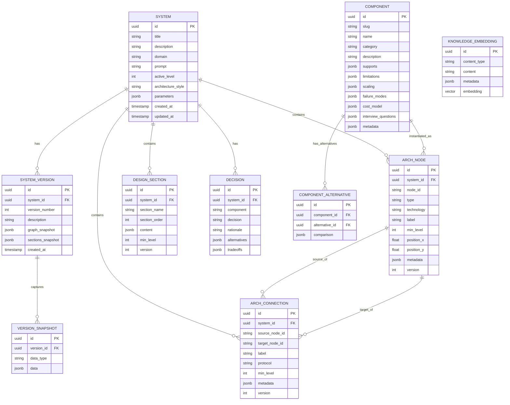

# 08 — Data Model

> PostgreSQL + pgvector — the structured architecture graph is the source of truth.

---

## ER Diagram



---

## Table Definitions

### `systems`

The top-level entity representing a system design.

```sql
CREATE TABLE systems (
    id              UUID PRIMARY KEY DEFAULT gen_random_uuid(),
    title           VARCHAR(200) NOT NULL,
    description     TEXT,
    domain          VARCHAR(100),
    prompt          TEXT NOT NULL,              -- Original user prompt
    active_level    INTEGER DEFAULT 2,          -- Current viewing level (0-4)
    architecture_style VARCHAR(50),             -- monolith, microservices, etc.
    parameters      JSONB DEFAULT '{}',         -- User parameters (users, budget, etc.)
    current_version INTEGER DEFAULT 1,
    created_at      TIMESTAMPTZ DEFAULT NOW(),
    updated_at      TIMESTAMPTZ DEFAULT NOW()
);

CREATE INDEX idx_systems_domain ON systems(domain);
CREATE INDEX idx_systems_created ON systems(created_at DESC);
```

### `arch_nodes`

Individual components in the architecture graph.

```sql
CREATE TABLE arch_nodes (
    id              UUID PRIMARY KEY DEFAULT gen_random_uuid(),
    system_id       UUID NOT NULL REFERENCES systems(id) ON DELETE CASCADE,
    node_id         VARCHAR(100) NOT NULL,      -- Logical ID (e.g., "api_gateway")
    type            VARCHAR(50) NOT NULL,        -- "service", "database", "cache", etc.
    technology      VARCHAR(100) NOT NULL,       -- "PostgreSQL", "Redis", "Kafka"
    label           VARCHAR(200) NOT NULL,       -- Display label
    min_level       INTEGER NOT NULL DEFAULT 0,  -- Minimum level to display (0-4)
    position_x      FLOAT DEFAULT 0,
    position_y      FLOAT DEFAULT 0,
    metadata        JSONB DEFAULT '{}',          -- Additional config (replicas, sharded, etc.)
    version         INTEGER DEFAULT 1,
    created_at      TIMESTAMPTZ DEFAULT NOW(),
    
    UNIQUE(system_id, node_id, version)
);

CREATE INDEX idx_nodes_system ON arch_nodes(system_id);
CREATE INDEX idx_nodes_type ON arch_nodes(type);
CREATE INDEX idx_nodes_level ON arch_nodes(min_level);
```

### `arch_connections`

Edges between nodes in the architecture graph.

```sql
CREATE TABLE arch_connections (
    id              UUID PRIMARY KEY DEFAULT gen_random_uuid(),
    system_id       UUID NOT NULL REFERENCES systems(id) ON DELETE CASCADE,
    source_node_id  VARCHAR(100) NOT NULL,
    target_node_id  VARCHAR(100) NOT NULL,
    label           VARCHAR(200),
    protocol        VARCHAR(50),                 -- "HTTPS", "gRPC", "async", "TCP"
    min_level       INTEGER NOT NULL DEFAULT 0,
    metadata        JSONB DEFAULT '{}',
    version         INTEGER DEFAULT 1,
    created_at      TIMESTAMPTZ DEFAULT NOW(),
    
    UNIQUE(system_id, source_node_id, target_node_id, version)
);

CREATE INDEX idx_connections_system ON arch_connections(system_id);
CREATE INDEX idx_connections_source ON arch_connections(source_node_id);
CREATE INDEX idx_connections_target ON arch_connections(target_node_id);
```

### `design_sections`

The 26-section schema content for each system.

```sql
CREATE TABLE design_sections (
    id              UUID PRIMARY KEY DEFAULT gen_random_uuid(),
    system_id       UUID NOT NULL REFERENCES systems(id) ON DELETE CASCADE,
    section_name    VARCHAR(50) NOT NULL,        -- "problem_definition", "functional_requirements", etc.
    section_order   INTEGER NOT NULL,            -- 1-26
    content         JSONB NOT NULL,              -- Section content (matches schema)
    min_level       INTEGER NOT NULL DEFAULT 0,  -- Minimum level to display
    version         INTEGER DEFAULT 1,
    created_at      TIMESTAMPTZ DEFAULT NOW(),
    
    UNIQUE(system_id, section_name, version)
);

CREATE INDEX idx_sections_system ON design_sections(system_id);
CREATE INDEX idx_sections_name ON design_sections(section_name);
```

### `decisions`

Architecture decisions with rationale (for the "Why?" feature).

```sql
CREATE TABLE decisions (
    id              UUID PRIMARY KEY DEFAULT gen_random_uuid(),
    system_id       UUID NOT NULL REFERENCES systems(id) ON DELETE CASCADE,
    component       VARCHAR(100) NOT NULL,       -- Which component this decision is about
    decision        TEXT NOT NULL,                -- What was decided
    rationale       TEXT NOT NULL,                -- Why
    alternatives    JSONB DEFAULT '[]',           -- What else was considered
    tradeoffs       JSONB DEFAULT '[]',           -- Pros/cons
    created_at      TIMESTAMPTZ DEFAULT NOW()
);

CREATE INDEX idx_decisions_system ON decisions(system_id);
CREATE INDEX idx_decisions_component ON decisions(component);
```

### `system_versions`

Snapshot of the entire system at a point in time.

```sql
CREATE TABLE system_versions (
    id              UUID PRIMARY KEY DEFAULT gen_random_uuid(),
    system_id       UUID NOT NULL REFERENCES systems(id) ON DELETE CASCADE,
    version_number  INTEGER NOT NULL,
    description     TEXT,                         -- What changed in this version
    graph_snapshot  JSONB NOT NULL,               -- Full node+connection snapshot
    sections_snapshot JSONB NOT NULL,             -- Full sections snapshot
    created_at      TIMESTAMPTZ DEFAULT NOW(),
    
    UNIQUE(system_id, version_number)
);

CREATE INDEX idx_versions_system ON system_versions(system_id);
```

### `components` (Knowledge Base)

```sql
CREATE TABLE components (
    id              UUID PRIMARY KEY DEFAULT gen_random_uuid(),
    slug            VARCHAR(100) UNIQUE NOT NULL, -- "postgresql", "kafka", "redis"
    name            VARCHAR(200) NOT NULL,         -- "PostgreSQL"
    category        VARCHAR(50) NOT NULL,          -- "database", "cache", "queue", etc.
    description     TEXT NOT NULL,
    supports        JSONB DEFAULT '[]',            -- ["relational", "acid", "complex_queries"]
    limitations     JSONB DEFAULT '[]',            -- ["limited_horizontal_scaling"]
    scaling         JSONB DEFAULT '{}',            -- Scaling strategies
    failure_modes   JSONB DEFAULT '[]',            -- Common failure scenarios
    cost_model      JSONB DEFAULT '{}',            -- Pricing information
    interview_questions JSONB DEFAULT '[]',        -- Common interview questions
    metadata        JSONB DEFAULT '{}',            -- Additional metadata
    created_at      TIMESTAMPTZ DEFAULT NOW()
);

CREATE INDEX idx_components_category ON components(category);
CREATE INDEX idx_components_slug ON components(slug);
```

### `component_alternatives`

```sql
CREATE TABLE component_alternatives (
    id              UUID PRIMARY KEY DEFAULT gen_random_uuid(),
    component_id    UUID NOT NULL REFERENCES components(id) ON DELETE CASCADE,
    alternative_id  UUID NOT NULL REFERENCES components(id) ON DELETE CASCADE,
    comparison      JSONB NOT NULL,               -- Star ratings per requirement
    
    UNIQUE(component_id, alternative_id)
);
```

### `knowledge_embeddings` (RAG)

```sql
CREATE EXTENSION IF NOT EXISTS vector;

CREATE TABLE knowledge_embeddings (
    id              UUID PRIMARY KEY DEFAULT gen_random_uuid(),
    content_type    VARCHAR(50) NOT NULL,         -- "component", "pattern", "example", "practice"
    content         TEXT NOT NULL,
    metadata        JSONB DEFAULT '{}',
    embedding       vector(1536) NOT NULL,        -- OpenAI text-embedding-3-small
    created_at      TIMESTAMPTZ DEFAULT NOW()
);

CREATE INDEX idx_embeddings_type ON knowledge_embeddings(content_type);
CREATE INDEX idx_embeddings_vector ON knowledge_embeddings 
    USING ivfflat (embedding vector_cosine_ops) WITH (lists = 100);
```

---

## Redis Schema

```
# Session / UI state
session:{user_id}                    → JSON (user preferences, active system)

# Capacity calculation cache
capacity:{hash(params)}              → JSON (CapacityEstimate)
                                       TTL: 1 hour

# Cost estimation cache
cost:{hash(graph+capacity)}          → JSON (CostEstimate)
                                       TTL: 1 hour

# AI response cache
ai:explain:{component}:{system_id}   → JSON (ComponentExplanation)
                                       TTL: 30 minutes

ai:command:{hash(command+graph)}     → JSON (AIResponse)
                                       TTL: 15 minutes

# Rate limiting
ratelimit:{user_id}:{endpoint}       → Counter
                                       TTL: 60 seconds
```

---

## Graph Operations

### Get Full Architecture Graph

```sql
-- Get all nodes and connections for a system, filtered by level
SELECT 
    n.node_id, n.type, n.technology, n.label, n.min_level,
    n.position_x, n.position_y, n.metadata
FROM arch_nodes n
WHERE n.system_id = :system_id 
  AND n.version = (SELECT current_version FROM systems WHERE id = :system_id)
  AND n.min_level <= :active_level
ORDER BY n.min_level, n.node_id;

SELECT 
    c.source_node_id, c.target_node_id, c.label, c.protocol, c.min_level, c.metadata
FROM arch_connections c
WHERE c.system_id = :system_id
  AND c.version = (SELECT current_version FROM systems WHERE id = :system_id)
  AND c.min_level <= :active_level
  -- Only show connections where both nodes are visible
  AND c.source_node_id IN (SELECT node_id FROM arch_nodes WHERE system_id = :system_id AND min_level <= :active_level)
  AND c.target_node_id IN (SELECT node_id FROM arch_nodes WHERE system_id = :system_id AND min_level <= :active_level);
```

### Apply AI Diff (Atomic)

```python
async def apply_diff(self, system_id: UUID, diff: GraphDiff) -> SystemDesign:
    """Apply a graph diff atomically within a transaction."""
    
    async with self.db.begin():
        # Create new version
        new_version = current_version + 1
        
        # Copy all existing nodes to new version
        await self.db.execute(
            insert(ArchNode).from_select(
                [...],
                select(ArchNode).where(
                    ArchNode.system_id == system_id,
                    ArchNode.version == current_version,
                    ArchNode.node_id.notin_(diff.remove_nodes),
                )
            ).values(version=new_version)
        )
        
        # Add new nodes
        for node in diff.add_nodes:
            await self.db.execute(
                insert(ArchNode).values(
                    system_id=system_id,
                    version=new_version,
                    **node.dict(),
                )
            )
        
        # Similar for connections...
        
        # Update system version
        await self.db.execute(
            update(System)
            .where(System.id == system_id)
            .values(current_version=new_version)
        )
        
        # Snapshot for version history
        await self._create_version_snapshot(system_id, new_version, diff.description)
```

---

## Migration Strategy

Using Alembic for schema migrations:

```
migrations/
├── env.py
└── versions/
    ├── 001_initial_schema.py
    ├── 002_add_knowledge_embeddings.py
    ├── 003_add_version_history.py
    └── ...
```

---

## Related Documents

- [06-backend-architecture.md](./06-backend-architecture.md) — SQLAlchemy models
- [07-ai-engine.md](./07-ai-engine.md) — How AI reads/writes the graph
- [09-component-knowledge-base.md](./09-component-knowledge-base.md) — Component data
