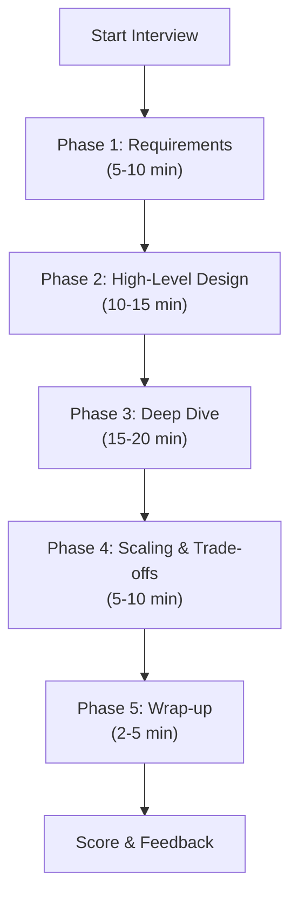

# 14 — Interview Mode

> AI-powered system design interview simulator.

---

## Overview

Interview Mode transforms the platform into a system design interview simulator. The AI acts as an interviewer with configurable difficulty, personality, and evaluation criteria.

---

## Interview Configuration

```
┌─────────────────────────────────────────┐
│ System Design Interview                 │
│                                         │
│ System:                                 │
│ ┌─────────────────────────────────────┐ │
│ │ Design Uber                        ▼│ │
│ └─────────────────────────────────────┘ │
│                                         │
│ Difficulty:                             │
│ ○ Junior     ○ Mid     ● Senior         │
│ ○ Staff      ○ Principal                │
│                                         │
│ Duration:                               │
│ ○ 30 min     ● 45 min   ○ 60 min       │
│                                         │
│ Interviewer Style:                      │
│ ○ Friendly   ● Neutral  ○ Strict        │
│                                         │
│ Focus Areas (optional):                 │
│ ☑ Scalability                           │
│ ☑ Database Design                       │
│ ☐ Security                              │
│ ☑ Trade-offs                            │
│ ☐ Cost Optimization                     │
│                                         │
│ [ Start Interview ]                     │
└─────────────────────────────────────────┘
```

---

## Interview Flow



### Phase 1: Requirements Gathering (5-10 min)

AI asks:
- "Design Uber. Where would you like to start?"
- "What are the functional requirements?"
- "What about non-functional requirements?"
- "Any assumptions about scale?"
- "What's in scope and out of scope?"

**Evaluation**: Does the candidate clarify requirements before jumping to design?

### Phase 2: High-Level Design (10-15 min)

AI asks:
- "Can you draw the high-level architecture?"
- "Walk me through the main components."
- "How do these services communicate?"
- "What database would you choose and why?"

The user builds on the canvas while explaining.

### Phase 3: Deep Dive (15-20 min)

AI probes specific areas:
- "How would you handle location updates from 5 million drivers?"
- "Walk me through the matching algorithm."
- "How does the pricing engine work?"
- "What happens during a surge?"

### Phase 4: Scaling & Trade-offs (5-10 min)

AI challenges:
- "Can this handle 10× the traffic?"
- "What happens if Redis goes down?"
- "Why Kafka instead of RabbitMQ?"
- "What are the bottlenecks?"

### Phase 5: Wrap-up (2-5 min)

AI asks:
- "What would you do differently with unlimited time?"
- "What's the most critical risk in this design?"
- "Any questions for me?"

---

## Scoring Rubric

```python
@dataclass
class InterviewScore:
    overall: float                    # 0-10
    
    dimensions: dict[str, DimensionScore]
    
    strengths: list[str]
    improvements: list[str]
    
    summary: str

@dataclass
class DimensionScore:
    score: float                      # 0-10
    weight: float                     # How much this counts
    feedback: str                     # Specific feedback
```

### Scoring Dimensions

| Dimension | Weight (Senior) | What's Evaluated |
|---|---|---|
| **Requirements Gathering** | 10% | Did they clarify before designing? |
| **Capacity Estimation** | 10% | Were the estimates reasonable? |
| **High-Level Architecture** | 20% | Is the overall design sound? |
| **Database Design** | 15% | Right database choice? Good schema? |
| **Scalability** | 15% | Can it handle the stated scale? |
| **Trade-offs** | 10% | Did they discuss trade-offs? |
| **Communication** | 10% | Clear explanations? Structured thinking? |
| **Deep Knowledge** | 10% | Depth of technical understanding? |

### Scoring Scale

| Score | Label | Description |
|---|---|---|
| 9-10 | Exceptional | Exceeds expectations, novel insights |
| 7-8 | Strong | Meets all expectations, good depth |
| 5-6 | Adequate | Basic coverage, some gaps |
| 3-4 | Weak | Significant gaps, surface-level |
| 1-2 | Poor | Missing fundamentals |

---

## AI Interviewer Prompts

### Interviewer System Prompt

```python
INTERVIEWER_SYSTEM_PROMPT = """
You are a system design interviewer at a top tech company.

## Interview Parameters
- System: {system_name}
- Difficulty: {difficulty}
- Duration: {duration_minutes} minutes
- Style: {interviewer_style}
- Focus Areas: {focus_areas}
- Current Phase: {current_phase}

## Your Behavior
1. Start by asking the candidate to design the system.
2. Let them lead — don't give answers.
3. Ask clarifying follow-up questions.
4. Probe deeper on interesting answers.
5. Challenge weak areas.
6. Keep track of time (use phase transitions).
7. Adjust difficulty based on candidate level.

## Style Guide
- Friendly: Encouraging, hints when stuck, "That's a good point, and..."
- Neutral: Professional, balanced, "Can you elaborate on..."
- Strict: Challenging, no hints, "I don't think that would work because..."

## Current Architecture (from canvas)
{current_architecture_json}

## What the candidate has covered so far
{covered_topics}

## What hasn't been covered yet
{uncovered_topics}

## Phase Timing
Current time: {elapsed_minutes} minutes
Phase deadline: {phase_deadline_minutes} minutes

## Rules
- ONE question at a time
- Don't reveal the "right" answer
- Note what they got right and wrong (for scoring)
- If they're stuck for > 2 minutes, give a gentle nudge (friendly/neutral) or move on (strict)
"""
```

---

## Interview Feedback Report

```
┌─────────────────────────────────────────────────┐
│ Interview Results                                │
│                                                  │
│ System: Uber                                     │
│ Difficulty: Senior                               │
│ Duration: 42 minutes                             │
│                                                  │
│ Overall Score: 7.4 / 10        ████████░░        │
│                                                  │
│ ─────────────────────────────────────────────── │
│                                                  │
│ Requirements         8/10  ████████░░            │
│ Capacity Estimation  7/10  ███████░░░            │
│ Architecture         9/10  █████████░            │
│ Database Design      6/10  ██████░░░░            │
│ Scalability          8/10  ████████░░            │
│ Trade-offs           7/10  ███████░░░            │
│ Communication        9/10  █████████░            │
│ Deep Knowledge       6/10  ██████░░░░            │
│                                                  │
│ ─────────────────────────────────────────────── │
│                                                  │
│ Strengths:                                       │
│ ✓ Clear requirement gathering                    │
│ ✓ Good high-level architecture                   │
│ ✓ Excellent communication                        │
│                                                  │
│ Areas for Improvement:                           │
│ ✗ Database sharding strategy needs more depth    │
│ ✗ Didn't discuss disaster recovery               │
│ ✗ Kafka partition strategy was vague             │
│                                                  │
│ Key Moments:                                     │
│ 🎯 Great insight about geohashing for location   │
│ ⚠️ Struggled with matching algorithm design      │
│ ✓ Recovered well when challenged on Redis choice │
│                                                  │
│ [ View Full Transcript ] [ Retry ] [ New System ]│
└─────────────────────────────────────────────────┘
```

---

## Difficulty Scaling

| Aspect | Junior | Mid | Senior | Staff | Principal |
|---|---|---|---|---|---|
| Requirements depth | Basic | Moderate | Deep | Very deep | Exhaustive |
| Scale | 1K users | 100K users | 10M users | 100M users | 1B users |
| Components expected | 3-5 | 5-10 | 10-20 | 15-30 | 20-40 |
| Challenge questions | None | Few | Several | Many | Intense |
| Trade-off discussion | Minimal | Some | Required | Deep | Critical |
| Failure scenarios | None | Basic | Multiple | Comprehensive | Chaos mode |
| Cost discussion | None | None | Mentioned | Detailed | Optimized |
| Multi-region | No | No | Maybe | Yes | Required |

---

## Related Documents

- [07-ai-engine.md](./07-ai-engine.md) — AI prompting for interviewer
- [13-canvas-architecture.md](./13-canvas-architecture.md) — Canvas during interview
- [17-system-design-library.md](./17-system-design-library.md) — Pre-built systems for interview
