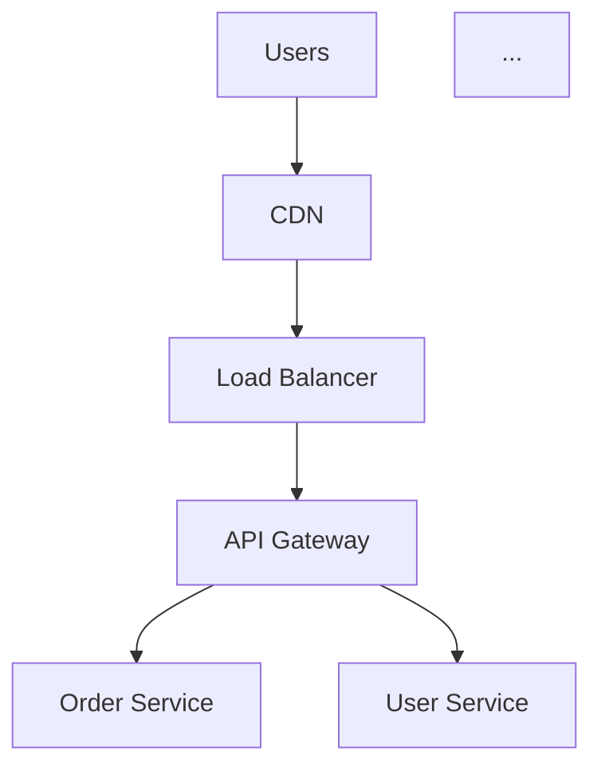

# 16 — Export System

> Export architectures in multiple formats — PNG, SVG, PDF, JSON, Markdown, Mermaid, Terraform, K8s YAML.

---

## Supported Export Formats

| Format | Phase | Description | Use Case |
|---|---|---|---|
| **PNG** | MVP | Raster image of architecture | Share on Slack, embed in docs |
| **SVG** | MVP | Vector image of architecture | High-quality presentations |
| **JSON** | MVP | Structured architecture graph | Import/export, version control |
| **Markdown** | MVP | Full design document | README, documentation, wiki |
| **Mermaid** | MVP | Mermaid diagram syntax | Embed in GitHub/GitLab |
| **PDF** | V2 | Professional design document | Reports, presentations |
| **API Spec** | V2 | OpenAPI/Swagger | Development handoff |
| **Terraform** | V3 | Infrastructure as Code | Deploy architecture |
| **K8s YAML** | V3 | Kubernetes manifests | Container orchestration |

---

## JSON Export

The canonical format — the complete architecture graph:

```json
{
  "version": "1.0",
  "exported_at": "2024-01-15T12:00:00Z",
  "system": {
    "title": "Food Delivery Platform",
    "description": "A food delivery platform for 10M users",
    "domain": "food_delivery",
    "parameters": {
      "total_users": 10000000,
      "dau": 3000000,
      "availability": "99.99%",
      "regions": "multi-region",
      "budget_monthly": 20000
    }
  },
  "architecture": {
    "nodes": [
      {
        "id": "api_gateway",
        "type": "api_gateway",
        "technology": "Kong",
        "label": "API Gateway",
        "min_level": 1,
        "position": { "x": 400, "y": 100 },
        "metadata": { "rate_limit": "1000 req/min" }
      }
    ],
    "connections": [
      {
        "source": "api_gateway",
        "target": "order_service",
        "protocol": "HTTPS",
        "label": "REST API",
        "min_level": 1
      }
    ]
  },
  "sections": {
    "problem_definition": { "..." : "..." },
    "functional_requirements": { "..." : "..." },
    "capacity_estimation": { "..." : "..." }
  },
  "decisions": [
    {
      "component": "PostgreSQL",
      "decision": "Primary database for order data",
      "rationale": "ACID transactions required for financial data",
      "alternatives": ["DynamoDB", "MongoDB"]
    }
  ]
}
```

---

## Markdown Export

Generates a complete system design document:

```markdown
# Food Delivery Platform — System Design

## Problem Definition
A food delivery platform similar to Uber Eats...

## Functional Requirements
- Users can browse restaurants
- Users can place orders
- Drivers can accept deliveries
...

## Architecture



## Capacity Estimation
| Metric | Value |
|---|---|
| DAU | 3,000,000 |
| Peak RPS | 8,680 |
...

[... all 26 sections ...]
```

---

## Mermaid Export

```python
def graph_to_mermaid(nodes: list[ArchNode], connections: list[ArchConnection]) -> str:
    lines = ["graph TB"]
    
    # Node definitions
    for node in nodes:
        icon = get_icon(node.type)
        label = f'{node.id}["{icon} {node.label}<br/>{node.technology}"]'
        lines.append(f"    {label}")
    
    # Connections
    for conn in connections:
        label = conn.label or conn.protocol or ""
        if conn.protocol == "async":
            arrow = "-.->|" + label + "|"
        else:
            arrow = "-->|" + label + "|"
        lines.append(f"    {conn.source} {arrow} {conn.target}")
    
    # Styling
    lines.append("")
    for node in nodes:
        style_class = f"style {node.id} fill:{get_color(node.type)},stroke:#333"
        lines.append(f"    {style_class}")
    
    return "\n".join(lines)
```

---

## Terraform Export (V3)

```python
def graph_to_terraform(graph: ArchitectureGraph, provider: str = "aws") -> str:
    """Generate Terraform HCL from architecture graph.
    
    Maps:
    - database (PostgreSQL) → aws_db_instance
    - cache (Redis) → aws_elasticache_cluster
    - service → aws_ecs_service
    - load_balancer → aws_lb
    - cdn → aws_cloudfront_distribution
    - object_storage → aws_s3_bucket
    - message_queue (Kafka) → aws_msk_cluster
    """
    
    terraform = []
    
    for node in graph.nodes:
        match node.type:
            case "database" if node.technology == "PostgreSQL":
                terraform.append(f'''
resource "aws_db_instance" "{node.id}" {{
  identifier           = "{node.id}"
  engine               = "postgres"
  engine_version       = "16.1"
  instance_class       = "db.r6g.xlarge"
  allocated_storage    = 100
  multi_az             = true
  
  tags = {{
    Name = "{node.label}"
    System = "{graph.system_name}"
  }}
}}
''')
            case "cache" if node.technology == "Redis":
                terraform.append(f'''
resource "aws_elasticache_cluster" "{node.id}" {{
  cluster_id           = "{node.id}"
  engine               = "redis"
  node_type            = "cache.r6g.large"
  num_cache_nodes      = 3
  
  tags = {{
    Name = "{node.label}"
  }}
}}
''')
            # ... more component mappings
    
    return "\n".join(terraform)
```

---

## Export API

```
POST /api/v1/systems/{id}/export

Request:
{
  "format": "markdown",      // png, svg, json, markdown, mermaid, pdf, terraform, k8s
  "level": 3,                // Include components up to this level
  "include_sections": true,  // Include all 26 sections (markdown/pdf)
  "provider": "aws"          // For terraform/k8s
}

Response:
{
  "format": "markdown",
  "filename": "food_delivery_system_design.md",
  "content": "# Food Delivery Platform...",
  "content_type": "text/markdown"
}
```

For binary formats (PNG, SVG, PDF):

```
Response: Binary file download
Content-Type: image/png | image/svg+xml | application/pdf
```

---

## Related Documents

- [13-canvas-architecture.md](./13-canvas-architecture.md) — Canvas export hooks
- [06-backend-architecture.md](./06-backend-architecture.md) — Export API endpoints
- [18-api-specification.md](./18-api-specification.md) — Full API spec
